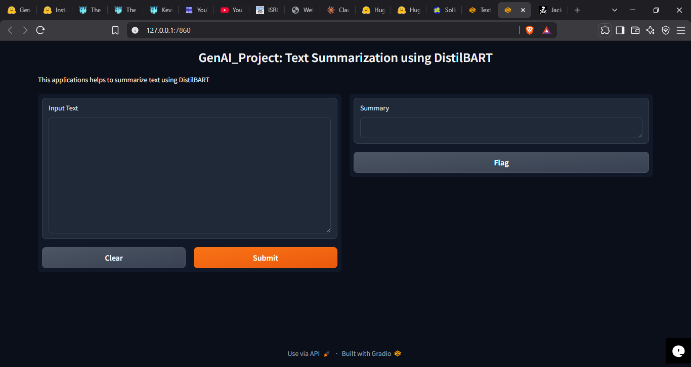
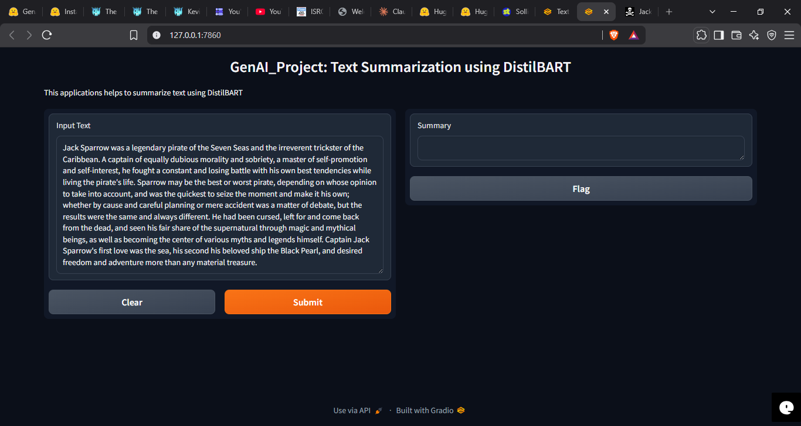
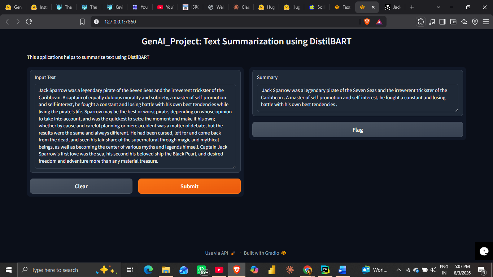

<<<<<<< HEAD
# Text Summarization using DistilBART

## Overview

This project is an AI-powered text summarization application built using Hugging Face Transformers, the DistilBART model, and Gradio. It generates concise summaries from long text while preserving the key information.

## Features

- Automatic text summarization
- DistilBART pre-trained model
- Interactive Gradio web interface
- Local inference using PyTorch
- Easy deployment to cloud platforms

## Tech Stack

- Python 3.10
- PyTorch
- Hugging Face Transformers
- Gradio

## Project Structure

```
Text-Summarization/
│
├── app.py
├── requirements.txt
├── README.md
├── LICENSE
└── .gitignore
```

## Installation

```bash
git clone https://github.com/Sateeshkumar4425/Text-Summarization.git
cd Text-Summarization

python -m venv .venv
.\.venv\Scripts\activate

pip install -r requirements.txt
```

## Run the Application

```bash
python app.py
```

The application will be available at:

```
http://127.0.0.1:7860
```

## Model

This project uses the following Hugging Face model:

- sshleifer/distilbart-cnn-12-6

The model will be downloaded automatically during the first execution if it is not already available locally.

## Future Improvements

- PDF summarization
- URL summarization
- Batch document summarization
- Model selection
- Deployment on Render

## Author

**Sateesh Kumar**

GitHub: https://github.com/Sateeshkumar4425
=======
# Text Summarization using DistilBART

## Overview

This project is an AI-powered text summarization application built using Hugging Face Transformers, the DistilBART model, and Gradio. It generates concise summaries from long text while preserving the key information.

## Features

- Automatic text summarization
- DistilBART pre-trained model
- Interactive Gradio web interface
- Local inference using PyTorch
- Easy deployment to cloud platforms

## Tech Stack

- Python 3.10
- PyTorch
- Hugging Face Transformers
- Gradio

## Project Structure

```
Text-Summarization/
│
├── app.py
├── requirements.txt
├── README.md
├── LICENSE
└── .gitignore
```

## Installation

```bash
git clone https://github.com/Sateeshkumar4425/Text-Summarization.git
cd Text-Summarization

python -m venv .venv
.\.venv\Scripts\activate

pip install -r requirements.txt
```

## Run the Application

```bash
python app.py
```

The application will be available at:

```
http://127.0.0.1:7860
```

## Model

This project uses the following Hugging Face model:

- sshleifer/distilbart-cnn-12-6

The model will be downloaded automatically during the first execution if it is not already available locally.


## Application Preview

### Home Screen



### Input Example



### Generated Summary




## Future Improvements

- PDF summarization
- URL summarization
- Batch document summarization
- Model selection
- Deployment on Render

## Author

**Sateesh Kumar Patlegar**

Gmail: patlegarsateeshkumar@gmail.com  
LinkedIn: https://www.linkedin.com/in/patlegar-sateesh-kumar-868870258/  
GitHub: https://github.com/Sateeshkumar4425

Open to Data Science, Analytics, Machine Learning, and Quantitative Research opportunities.
>>>>>>> 7d776450fcd713b4df7e26ee28e7820f418a51ba
